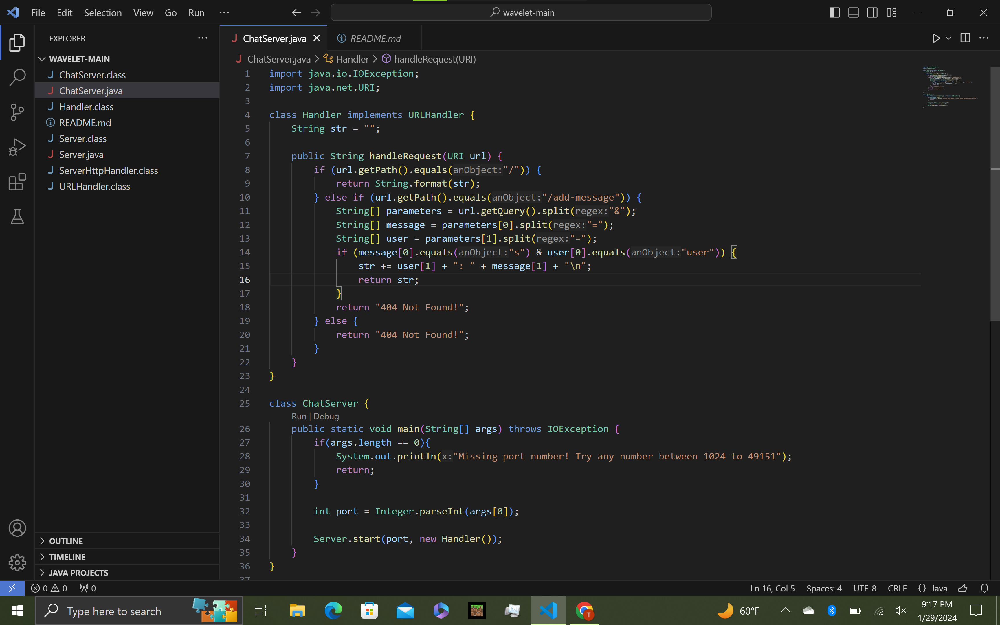
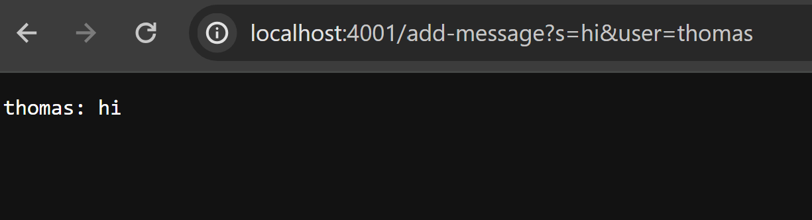
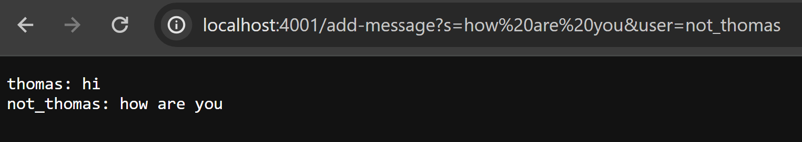
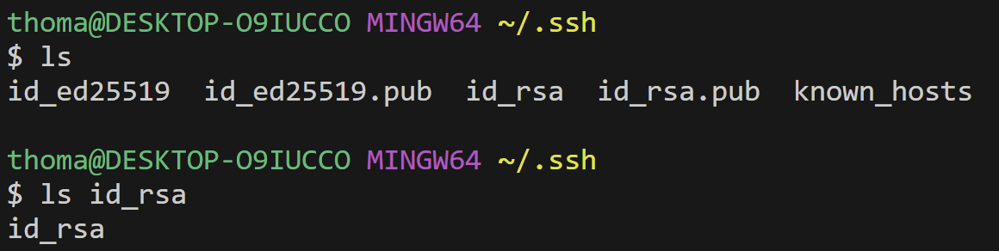
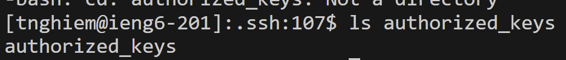
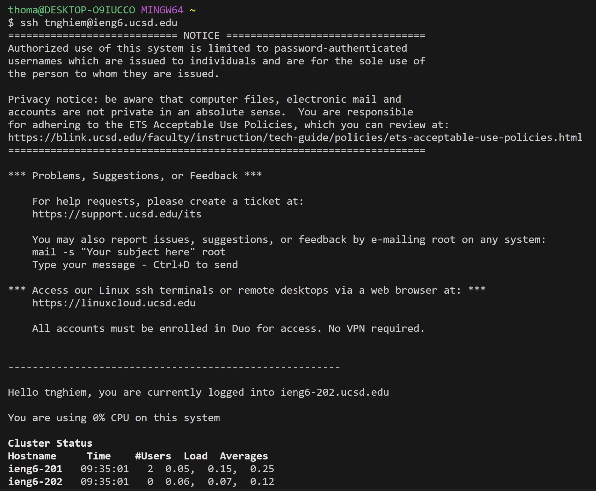

## Part 1
* Code   
  
* Screenshots  
  
The `handleRequest` method is called, which acts according to the structure of the `url`. This `Handler` class has a `String str` field, which is initialized as an empty string. As the method runs, the value of `str` changes as the message placed in the `url` is concatenated to the previous value of `str`, which at this time was empty. With the `url`, `http://localhost:4001:/add-message?s=hi&user=thomas`, changed the value of `str` to `"thomas: hi"`. 
  
The `handleRequest` method is called once again. The `String str` field of this `Handler` class already contains the returned value from the method's first run. As the method runs again with the `url` of `http://localhost:4001:/add-message?s=how%20are%20you&user=not_thomas`, the value of `str` changes to add `"not_thomas: how are you"` on a new line after `"thomas: hi"`.
## Part 2
* Private key absolute path
  
* Public key absolute path
  
* Login
  
## Part 3
Most of what we did in lab was new to me. First, I learned how to use `ssh` to connect to a server. Then, I learned how to run a server on my own computer, and this was cool to learn. Using this, I also learned how to work with the `URLHandler` interface, which we used to make the webserver `ChatServer`. 
